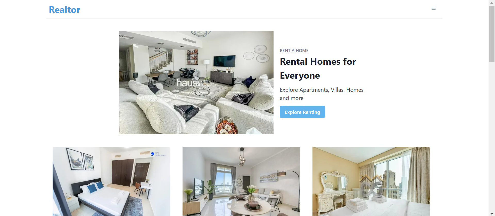

# Realtor

"Realtor" is an exceptional real estate web application meticulously crafted using ReactJS and NextJS. Seamlessly integrated with the Bayut API via RapidAPI, it offers users a comprehensive platform for discovering rental homes and for-sale properties. With an elegant Chakra UI CSS component-based interface, it ensures a visually pleasing and user-friendly experience. Key features include advanced property filtering, property details pages enriched with captivating image carousels, interactive maps for location visualization, user authentication, and review functionality. Realtor is your go-to destination for navigating the dynamic real estate market, simplifying property exploration, and making informed decisions.

## TechStack
Javascript | ReactJS | NextJS | CSS 

## Challenges Faced
> **API Integration Mastery:** Successfully integrated the Bayut API via RapidAPI, marking a significant achievement in project development.

> **Complex Search Filters:** Overcame the intricacies of crafting advanced property filtering mechanisms, enhancing user search capabilities.

> **Image Carousel Expertise:** Skillfully developed image carousels, elevating the visual appeal and user engagement of the application.

> **Continuous Learning:** Demonstrated a commitment to continuous improvement and technical advancement in web development.

> **User-Centric Focus:** Strived to deliver a polished, user-friendly experience in the real estate application "Realtor."

## Visuals

